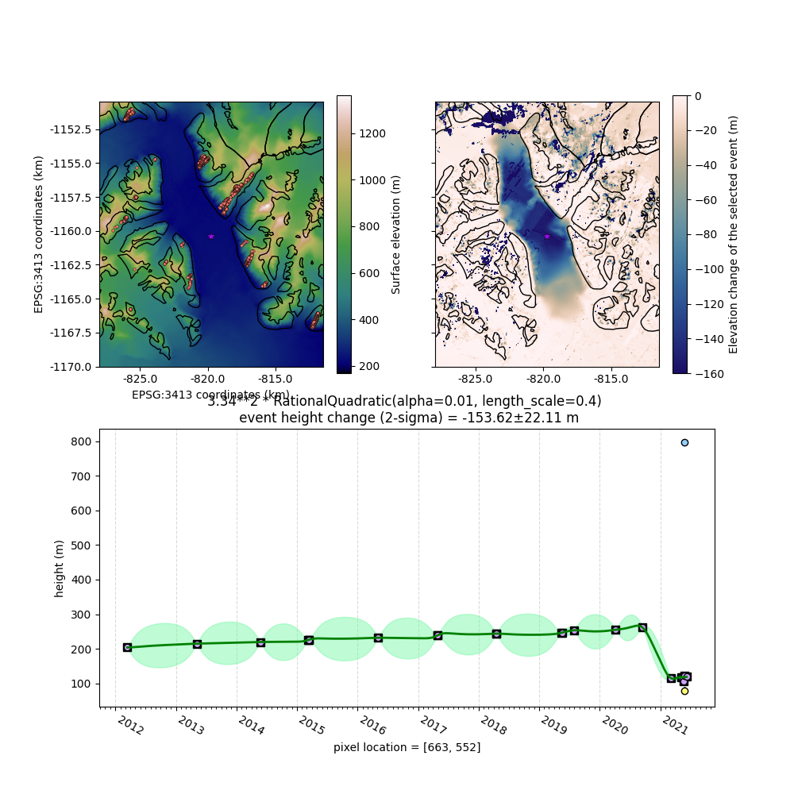

# Supplementary information for "Widespread and rapid dynamics of subglacial water in the Canadian Arctic"

Whyjay Zheng [1]*, Wesley Van Wychen [2] and Tian Li [3]

1. Center for Space and Remote Sensing Research, National Central University, Taoyuan City, 320317, Taiwan.
2. Department of Geography and Environmental Management, University of Waterloo, Waterloo, N2L 3G1, Ontario, Canada.
3. Bristol Glaciology Centre, University of Bristol, Bristol, BS8 1SS, UK.

*Corresponding author(s). E-mail(s): whyjz@csrsr.ncu.edu.tw

Contributing authors: wesley.van.wychen@uwaterloo.ca; tian.li@bristol.ac.uk

## Supplementary figures S1--S33

All supplementary figures have three panels:

- Upper left panel: Surface elevation around the lake, ICESat-2 measurement locations for DEM alignment (orange dots), RGI 7.0 glacier outlines (black lines), and sampling location for the lower panel (star marker).
- Upper right panel: An enlarged version of the corresponding panel from Figure 2. Showing the maximum elevation change during a rapid event or an accumulated elevation change during the observation period.
- Lower panel: ArcticDEM elevation data at the selected sample location. Figure 4 displays some of these panels. 

**Figure S1.** Analysis results of the lake #1. 

**Figure S2.** Analysis results of the lake #2. 

**Figure S3.** Analysis results of the lakes #3-a, #3-b, and #3-c. 

**Figure S4.** Analysis results of the lakes #4-a and #4-b. 

**Figure S5.** Analysis results of the lake #5. 

**Figure S6.** Analysis results of the lake #6. 

**Figure S7.** Analysis results of the lake #7. 

**Figure S8.** Analysis results of the lake #8. 

**Figure S9.** Analysis results of the lake #9. 

**Figure S10.** Analysis results of the lake #10. 

**Figure S11.** Analysis results of the lake #11. 

**Figure S12.** Analysis results of the lake #12. 

**Figure S13.** Analysis results of the lake #13. 

**Figure S14.** Analysis results of the lake #14. 

**Figure S15.** Analysis results of the lake #15. 

**Figure S16.** Analysis results of the lake #16. 

**Figure S17.** Analysis results of the lake #17. 

**Figure S18.** Analysis results of the lake #18. 

**Figure S19.** Analysis results of the lake #19. 

**Figure S20.** Analysis results of the lake #20. 

**Figure S21.** Analysis results of the lake #21. 

**Figure S22.** Analysis results of the lake #22. 

**Figure S23.** Analysis results of the lake #23. 

**Figure S24.** Analysis results of the lake #24. 

**Figure S25.** Analysis results of the lake #25. 

**Figure S26.** Analysis results of the lakes #26 and #27. 

**Figure S27.** Analysis results of the lake #28. 

**Figure S28.** Analysis results of the lake #29. 

**Figure S29.** Analysis results of the lake #30. 

**Figure S30.** Analysis results of the lake #31. 

**Figure S31.** Analysis results of the lake #32. 

**Figure S32.** Analysis results of the lake #33. 

**Figure S33.** Analysis results of the lake #34. 
